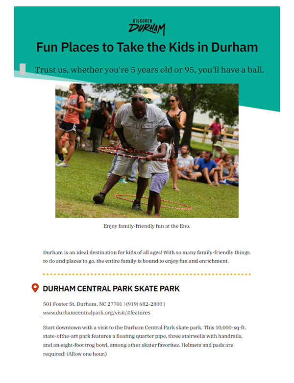

# Discover Durham Website Tools
A collection of custom markup, styling, scripts, and other snippets for extending functionality on the Discover Durham website.

## Custom styles for printable itineraries
Custom CSS styling to make itineraries hosted on the Discover Durham website aesthetically pleasing when printed out on a home or office computer.

| Original Browser Version | Default Printer Version | Custom Styled Printer Version |
| ----------------------- | ----------------------- | ----------------------------- |
|  |  |  |

💡 [Learn more in the **printable-itineraries** directory](printable-itineraries "Custom Styles for Printable Itineraries")

## Table-of-contents dropdown menu
A dynamic, hyperlinked dropdown list that will auto-populate with all H2s on the page that contain IDs.

💡 [Learn more in the **table-of-contents-dropdown** directory](table-of-contents-dropdown "Table-of-Contents Dropdown Menu")
