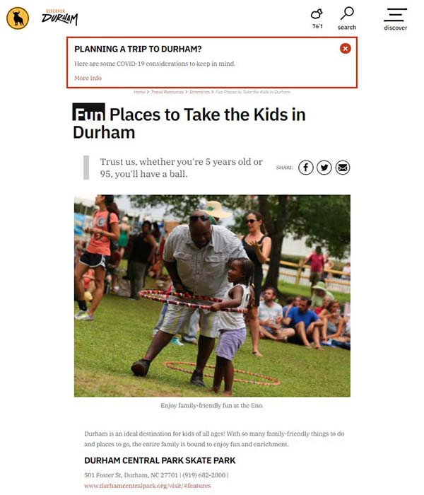
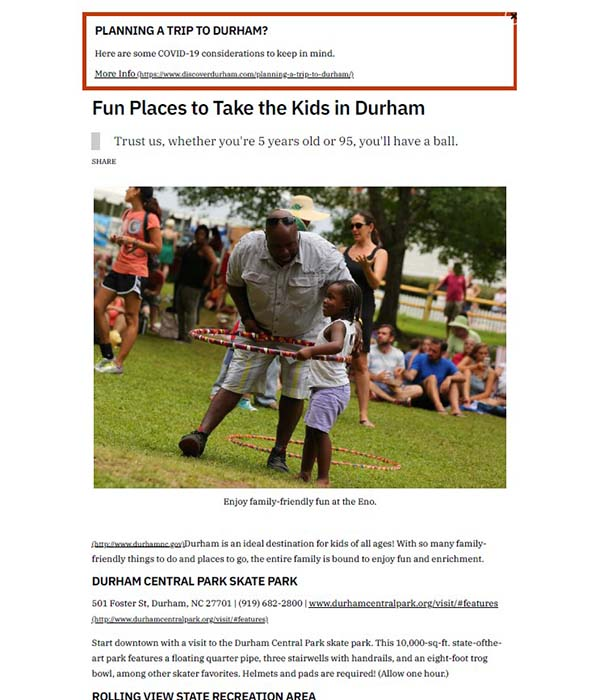

# Custom Styles for Printable Itineraries
Use custom styling to make itineraries hosted on the Discover Durham website aesthetically pleasing when printed out on a home or office computer.

| Original Browser Version | Default Printer Version | Custom Styled Printer Version |
| ----------------------- | ----------------------- | ----------------------------- |
|  |  |  |

## How to add the custom styles
To activate these custom styles on a page of the website, do the following:
1. Make sure you are logged into the Discover Durham website CMS.
2. Visit the itinerary post or page you would like to make printer-friendly, and click the `edit this entry` button to edit the page contents.
3. In the page editor, click on the `Digital Marketing` tab.
4. In the **Head Analytics/Tracking Code** field, paste the following code (this will link the custom printer styles to that page):
```
<link rel="stylesheet"  type="text/css" href="https://jonathanelee.github.io/DD-website/printable-itineraries/style.css" />
```
5. In the **Opening Body Analytics/Tracking Code** field, paste the following code (this will tag the content within the page appropriately so that the newly linked styles will be applied):
```
<div class="ddx-itinerary"></div>
```
6. Save/publish the page for the changes to take effect. These styles mostly come into effect only when the page is printed (either to a physical printer or usinf the "Print to PDF" functionality), so the page may not look noticeably different. To see the styles in action, perform a test print by typing **CTRL+P** / **CMD+P**, which should print a version of the page with activated print styles.

## Automatically hidden and revealed content modules
Once this style is applied, **row content modules** will be hidden when the page is viewed on screen, but will be visible when the page is printed. You can make use of this module to display information or calls-to-action that aren't needed online, but are useful for offline viewers when they are later referencing the printed page.
Some examplesuses:
- Including CTAs that encourage users to follow Discover Durham social channels (normally links to these are visible in the menu and footer of the website, but those areas don't print, so it can be good to include this information somewhere printable)
- Information on how users can get help and resources at the Visitor Info Center either in person or via phone
### Hiding and revealing other content with additional classes

You can auto-hide/reveal other types of content as well by using the `ddx-print-hide` and `ddx-print-reveal` element classes when editing in HTML view.

| Class | Visibility On Screen | Visibility Printed |
| ----- | -------------------- | ------------------ |
| `ddx-print-hide` | visible | hidden |
| `ddx-print-reveal` | hidden | visible |

To apply these classes to content in the rich text editor, click on the `<>` button to switch to HTML view, locate the element you'd like to add the behavior to, and type `class="ddx-print-hide"` or `class="ddx-print-reveal"` inside the opening tag.

So for example, if I have `<p>Hello printer.</p>` in my text, and I only want it to be visible when printed, then I can add the neccesary class to the opening tag like so: `<p class="ddx-print-reveal">Hello printer.</p>`
